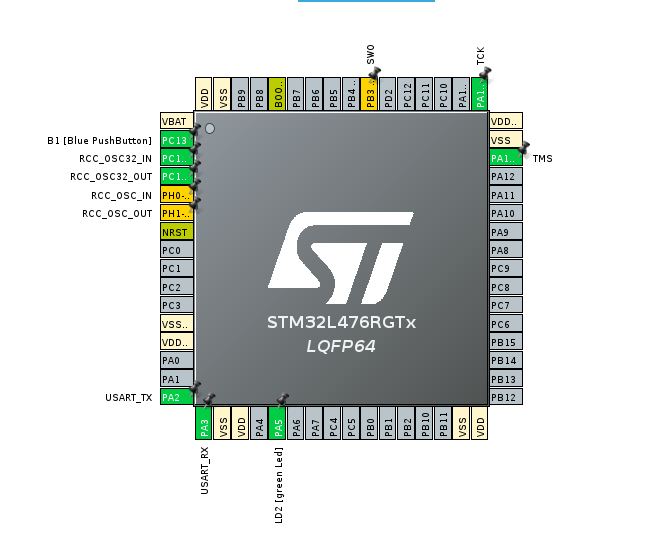

# Projekt na przedmiot Architektura oprogramowania systemów wbudowanych

## Autorzy 

- Michał Mokrzycki
- Karol Pieczka

### Development i struktura branchy
- *main*: Tylko przetestowany i działający kod, zabronione commitowanie na tego brancha,tylko merge z deva
- *dev*: możliwe proste commity, zalecane merge z innych branchy rozwijające funkcjonalności
- *inne branche*: niestabilny kod 

Należy zaczynać każdy plik poprzez ```/**```
Pozwoli to wygenerować Doxygen-style komentarze:
```
/**
 * @file app_core.h
 * @author your name (you@domain.com)
 * @brief 
 * @version 0.1
 * @date 2024-11-09
 * 
 * @copyright Copyright (c) 2024
 * 
 */ 
 (Pomijamy copyright i wersję)
```
Przydatne potem w tworzeniu dokumentacji.

#### Pinout

Konfiguracja stm32l476 na nucleo wygląda następująco:
(Należy updatować readme po konifguracji w cubemx)



Pin PA5 // GPIO Output No Pull up /// odpowiada za diodę L2D (green)
PC13 // // skonfigurowany od przycisk B1

PC7, PA8, PB10, PB4, PB5 - Led array pins // muszą zostać skonfigurowane w cube mx


### Znalezione Problemy

##### LED Array:
- nie działa dioda PC7
- na diodzie PB4 odkłada się jakieś niskie napięcie co powoduje lekkie świecenie tej diody nawet w stanie reset

#### Dokumentacja

- Nieścisłości/błędy w oznaczeniach
-i2c2 w dokumntacji to tak naprawdę i2c3, wskazane piny nie pozwalją na konfiguracj i2c2 tylko i2c3
- analogicznie spi to tak naprawdę spi2 i spi2 to spi3

`wydaje mi się ze to tylko kwestia nazewnictwa i nie powinno być problemów`