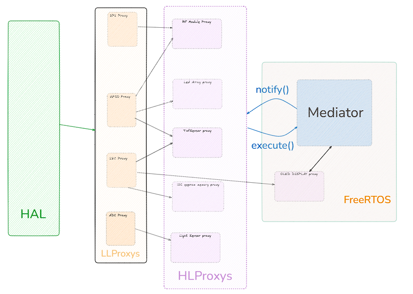
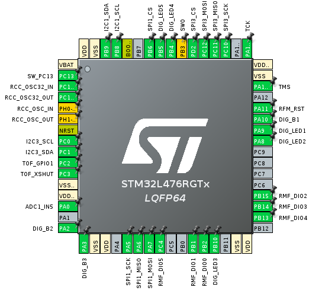

# AOSYW 2024 Z

## Autorzy
- Michał Mokrzycki
- Karol Pieczka

## Temat projetktu

Tematem przewodnim projektu jest aplikacja weryfikująca obecność danego peryferium na płytce Evalboard, z Shieldem. Na potrzeby projetku napisano uproszczone sterowniki dla czterech peryferiów. Testowanymi peryferiami są pamięć EEPROM, moduł RF, czujnik światła oraz czujnik Time-of-Flight.

### Metodologia testowania

Do każdego peryferium zostało napisane odpowiednie proxy odpowiadające za przebieg testu danego urządzenia. Każde z proxy dziedziczy po bazowym proxy wysokiego poziomu. Każde z peryferiów implementuje meotdę execute(), która zwraca wynik testu.

1. Moduł RF

Moduł RF jest testowany poprzez zapis i odczyt rejestru. Wybrany rejestr to jeden z wolnych rejestrów odpowiadających docelowo za synchronizację sygnału w procesach radiowych. Wartość zapisana jest porównywana z wartością odczytaną, w ten sposób weryfikując czy moduł odpowiada w jakikolwiek sposób.
Poniżej kod implementujący wspomnianą funkcjonalność.

```
static bool RFModuleProxy_execute(BaseHLProxy *self, ActionType action)
{
    if (action == EXECUTE) {

        RFModuleProxy *proxy = (RFModuleProxy *)self;

        uint8_t test_reg   = SX1276_REG;
        uint8_t test_value = 0x55;
        uint8_t read_value = 0;

        Gpio_t *gpio = proxy->base_proxy.gpio;
        gpio->set(gpio);

        proxy->write(proxy, test_reg, test_value);
        Spi_t *spi                = proxy->base_proxy.spi;
        uint8_t tx_read_buffer[2] = {test_reg & 0x7F, 0x00};
        uint8_t rx_read_buffer[2] = {0};
        spi->transmit_receive(spi, tx_read_buffer, rx_read_buffer, 2);
        
        Delay(500);

        read_value = rx_read_buffer[1];
        gpio->reset(gpio);
        return (read_value == test_value);
    } else {
        return false;
    }
}
```

2. Pamięć EEPPROM

Pamięć EEPROM jest testowana poprzez zapis oraz odczyt wartości z danego rejestru pamięci. W celu uniknięcia przypadkowego odczytania wartości w rejestrze, która była się w nim znajdowała przed zapisem, co by uniemożliwiło dedukcję poprawności testu, zapis jest realizowany dwukrotnie dla dwóch różnych wartości. Obie wartości muszą się zgadzać, aby test można było uznać jako pozytywny.
Poniżej implementacja wspomnianej funkcjonalności.

```
bool EEPROMProxy_execute(BaseHLProxy *self, ActionType action)
{
    EEPROMProxy *proxy = (EEPROMProxy *)self;

    uint8_t test_value_1 = 0x55;
    uint8_t test_value_2 = 0xAA;
    uint8_t read_value_1 = 0;
    uint8_t read_value_2 = 0;

    I2c_t *i2c = proxy->base_proxy.i2c;

    // Pierwszy test
    uint8_t txData1[2] = {TEST_REG, test_value_1};
    i2c->transmit(i2c, txData1, sizeof(txData1), EEPROM_ADDRESS << 1);

    // Czekaj na zapis
    HAL_Delay(5);

    uint8_t regAddress = TEST_REG;
    i2c->transmit(i2c, &regAddress, 1, EEPROM_ADDRESS << 1);
    i2c->receive(i2c, &read_value_1, 1, EEPROM_ADDRESS << 1);

    if (read_value_1 != test_value_1) {
        return false;
    }

    // Drugi test
    uint8_t txData2[2] = {TEST_REG, test_value_2};
    i2c->transmit(i2c, txData2, sizeof(txData2), EEPROM_ADDRESS << 1);

    // Czekaj na zapis
    HAL_Delay(5);

    // Odczyt wartości
    i2c->transmit(i2c, &regAddress, 1, EEPROM_ADDRESS << 1);
    i2c->receive(i2c, &read_value_2, 1, EEPROM_ADDRESS << 1);

    if (read_value_2 != test_value_2) {
        return false;
    }

    return true;
}
```

3. Czujnik światła

Czujnik światła jest sprawdzany za pomocą odczytu wartości, które zwraca za pomocją konwertera analogowo-cyfrowego. Test jest unzany za pozytywnym, jeśli w czasie 50ms wartość zwracana przez konwerter zmieni się przynajmniej o 10.
Poniżej kod implelemtujący funkcjonalność testu.

```
bool LightSensorProxy_execute(BaseHLProxy *self, ActionType action)
{
    LightSensorProxy *proxy = (LightSensorProxy *)self;
    Adc_t *adc              = proxy->base_proxy.adc;

    if (adc == NULL || adc->get_value == NULL) {
        return false;
    }

    // Odczyt wartości z czujnika w dwóch próbkach
    uint32_t value1 = adc->get_value(adc);
    HAL_Delay(50);
    uint32_t value2 = adc->get_value(adc);

    // Sprawdzenie różnicy pomiędzy próbkami
    int32_t diff = (int32_t)value2 - (int32_t)value1;

    // Warunek testu
    return abs(diff) > 10; // 10 jako próg wykrywalnej zmiany
}
```

4. Czujnik Time-of-Flight

Czujnik TOF (Time-of-Flight) jest sprawdzany poprzez odczytanie wartości z dwóch rejestrów za pomocą interfejsu I2C. Test jest uznawany za pozytywny, jeśli odczytane wartości z rejestrów są zgodne z oczekiwanymi: 0xEA dla rejestru Model_ID oraz 0xAA dla rejestru Module_Type (takie rejetsry sprawdzające poprawnośc komunikacji zostały przedstawione w dokumnetacji czujnika)

Poniżej kod implementujący funkcjonalność testu:

```
static bool TofSensorProxy_execute(BaseHLProxy *self, ActionType action)
{
    TofSensorProxy *proxy     = (TofSensorProxy *)self;
    uint32_t expected_value_1 = 0xEA; // Model_ID register value
    uint32_t expected_value_2 = 0xAA; // Module_Type register value
    uint32_t read_value_1     = 0;
    uint32_t read_value_2     = 0;

    I2c_t *i2c = proxy->base_proxy.i2c;

    uint8_t regAddress1[2] = {(uint8_t)(MODEL_ID_REGISTER >> 8),
                              (uint8_t)(MODEL_ID_REGISTER & 0xFF)};
    uint8_t rxData1[4]     = {0};

    i2c->transmit(i2c, regAddress1, sizeof(regAddress1),
                  TOF_SENSOR_ADDRESS << 1);
    i2c->receive(i2c, rxData1, sizeof(rxData1), TOF_SENSOR_ADDRESS << 1);

    read_value_1 = (rxData1[0] << 24) | (rxData1[1] << 16) | (rxData1[2] << 8) |
                   rxData1[3];

    if (read_value_1 != expected_value_1) {
        return false;
    }

    uint8_t regAddress2[2] = {(uint8_t)(MODULE_TYPE_REGISTER >> 8),
                              (uint8_t)(MODULE_TYPE_REGISTER & 0xFF)};
    uint8_t rxData2[4]     = {0};

    i2c->transmit(i2c, regAddress2, sizeof(regAddress2),
                  TOF_SENSOR_ADDRESS << 1);
    i2c->receive(i2c, rxData2, sizeof(rxData2), TOF_SENSOR_ADDRESS << 1);

    read_value_2 = (rxData2[0] << 24) | (rxData2[1] << 16) | (rxData2[2] << 8) |
                   rxData2[3];

    if (read_value_2 != expected_value_2) {
        return false;
    }

    return true;
}
```

### Architektura systemu
System oparty jest na procesorze STM32L476, który należy do energooszczędnej rodziny mikrokontrolerów STM32 z rdzeniem ARM Cortex-M4.
### Kluczowe komponenty systemu:
- **Moduły peryferyjne**: Zarządzanie poszczególnymi elementami systemu, takimi jak SPI, ADC, GPIO czy SPI
- **Proxy wysokiego poziomu**: Interfejsy abstrakcyjne, które umożliwiają ujednolicenie komunikacji z modułami peryferyjnymi.
- **Mediator**: Centralny moduł zarządzający komunikacją i koordynacją między różnymi proxy.

Architektura została zaprojektowana z myślą o modularności i łatwości utrzymania, co pozwala na łatwe rozszerzanie funkcjonalności w przyszłości.

### Środowisko programistyczne i automatyzacja generacji kodu

W projekcie wykorzystano środowisko programistyczne **Visual Studio Code**, rozszerzone o dodatki dedykowane dla STM32, takie jak **STM32CubeMX** i **STM32CubeIDE**. STM32CubeMX umożliwiło automatyczną generację kodu inicjalizacyjnego dla peryferiów, co znacząco przyspieszyło proces konfiguracji mikrokontrolera i zmniejszyło ryzyko błędów wynikających z ręcznej konfiguracji rejestrów.

Projekt został zaprojektowany w sposób umożliwiający łatwe dodawanie nowych platform sprzętowych. Dzięki wykorzystaniu metodologii opartej na automatycznej generacji kodu, wszelkie zmiany lub dodanie nowych peryferiów wymagały minimalnej modyfikacji kodu źródłowego, co znacznie poprawia elastyczność rozwiązania.

Cały projekt jest kompilowany przy pomocy plików konfiguracji **CMakeLists**, co zapewnia niezależność od konkretnego środowiska IDE. Dzięki zastosowaniu CMake proces budowy projektu jest bardziej uniwersalny i łatwo przenoszalny pomiędzy różnymi platformami programistycznymi oraz systemami operacyjnymi.

### Struktura projektu



Diagram przedstawia strukturę projektu opartą na warstwowej architekturze, wzbogaconą o Mediatora i zintegrowaną z systemem FreeRTOS. Rozwiązanie to ułatwia zarządzanie komunikacją i obsługę różnorodnych peryferiów.

HAL (Hardware Abstraction Layer): Warstwa abstrakcji sprzętowej, która izoluje dostęp do sprzętu, dostarczając jednolite interfejsy dla modułów wyższych warstw.

LLProxys (Low-Level Proxies): Moduły te oddzielają warstwę HAL od warstwy aplikacyjnej, tłumacząc specyficzne protokoły sprzętowe (np. SPI, I2C, ADC) na bardziej uniwersalne interfejsy. Dzięki temu warstwa aplikacyjna nie wymaga wiedzy o szczegółach sprzętowych.

HLProxys (High-Level Proxies): Moduły wysokopoziomowe, które implementują logikę specyficzną dla danych urządzeń (np. ToF Sensor Proxy, Light Sensor Proxy). Po wykonaniu polecenia execute() przesyłają wynik testu do Mediatora.

Mediator: Centralny moduł zarządzający komunikacją pomiędzy HLProxys. Wywołuje funkcję notify(), aby powiadomić wszystkie proxy o konieczności wykonania testów, a następnie zbiera wyniki od poszczególnych modułów. Mediator minimalizuje bezpośrednie zależności między komponentami, co upraszcza integrację.

FreeRTOS: Odpowiada za harmonogramowanie zadań w czasie rzeczywistym, zapewniając wydajną i bezpieczną pracę systemu. W głównej wersji aplikacji nie jest on wykorzystywany jednak jest zintegrowany z bazą projektu, która umożliwia łatwe jego dodanie w mediatorze. 

Dzięki takiej architekturze łatwo można dodawać nowe peryferia i moduły. Wystarczy utworzyć odpowiedni LL Proxy oraz HL Proxy, bez konieczności modyfikacji istniejącego kodu. 

### Stuktura Proxy
W celu umożliwienia przechowywania proxy przez mediator jako listy obiektów tego samego typu, zdecydowano się utworzyć klasę (strukturę) bazową - BaseHLProxy. Struktura ta pełni rolę interfejsu bazowego, który inne proxy wysokiego poziomu implementują jako jeden z atrybutów. Dzięki temu możliwe jest zunifikowanie zarządzania różnymi typami proxy.

Każde proxy wysokiego poziomu, takie jak obsługa modułu RFM czy komunikacji SPI, posiada własną implementację podstawowych funkcji, takich jak `execute` czy `shutdown`, a także innych funkcji specyficznych dla danego modułu, które są niezbędne do przeprowadzenia odpowiednich testów i operacji.

Przykład implementacji proxy dla modułu `RFM`:
```
typedef struct RFModuleProxy {
    BaseHLProxy base_proxy;
    void (*read)(struct RFModuleProxy *proxy, uint8_t reg);
    void (*write)(struct RFModuleProxy *proxy, uint8_t reg, uint8_t data);
} RFModuleProxy;

RFModuleProxy CreateRFModuleProxy(const char *name, Spi_t *spi, Gpio_t *gpio);
```
Funkcje Create["nazwa_proxy'] odpowiadają za inicjalizacje obiektu wraz z odpowiednimi peryferiami Low Level przypisanymi do tego modułu. Dzięki temu tworzenie proxy jest bardziej modułowe i elastyczne.
Przykładowo proxy odpowiadające za komunikację po SPI:
```
typedef struct Spi_t {
    SPI_HandleTypeDef *spi_handle;
    GPIO_TypeDef *csPort;
    uint16_t csPin;

    void (*configure)(struct Spi_t *self, SPI_HandleTypeDef *spi_handle,
                      GPIO_TypeDef *csPort, uint16_t csPin);
    void (*transmit)(struct Spi_t *self, uint8_t *data, size_t size);
    void (*receive)(struct Spi_t *self, uint8_t *data, size_t size);
    void (*set_cs)(struct Spi_t *self, uint16_t state);
    void (*transmit_receive)(struct Spi_t *self, uint8_t *txData,
                             uint8_t *rxData, size_t size);
} Spi_t;
```
Powyższa struktura Spi_t umożliwia łatwe wykorzystanie komunikacji SPI w module RFM, bez konieczności bezpośredniego używania funkcji z biblioteki HAL. Ułatwia to też mockowanie zależności sprzętowych, a co za tym idzie bardziej dokładne testowanie.

Aby wyeliminować zależność od bezpośredniego użycia funkcji z biblioteki HAL w modułach, które nie są częścią LLProxy, stworzono moduł `delay_manager`. Działa on jako wrapper nad funkcją do odmierzania czasu, zapewniając abstrakcję i izolację od implementacji HAL.

### Testowanie
Do testowania oprogramowania wykorzystano framework Ceedling, który pozwala na wygodne pisanie i uruchamianie testów jednostkowych w języku C. W procesie developmentu starano się stosować dobre praktyki inżynierii oprogramowania, takie jak iteracyjne podejście do wprowadzania zmian oraz wczesne i częste testowanie.

W celu eliminacji zależności od warstwy sprzętowej (np. Hardware Abstraction Layer - HAL), zastosowano mocki. Niektóre mocki zostały napisane od zera, ale w niektórych przypadkach użyto też gotowych mocków z frameworka *Ceedling*. Dzięki temu możliwe było przetestowanie logiki aplikacji niezależnie od fizycznego sprzętu oraz zminimalizowanie potencjalnych błędów związanych z integracją.

Wszystkie testy zostały zaprojektowane w taki sposób, aby były modularne i łatwe do utrzymania. Przypadki testowe pozwoliły upewnić się, że oprogramowanie działa zgodnie z założeniami w różnych scenariuszach.

Konfiguracja środowiska testowego zawarta jest w ***project.yml***.

#### Uruchomiene testów

W przypadku posiadania przez użytkownika zainstalowanego frameworka ceedling wystarczy wywołać w terminalu komendę:
```ceedlig test:all```
Wykona to wszystkie zaimplementowane testy. Można też przetestować wybrany moduł komendą :
`ceedling test:<module_name>`.

### Użyte biblioteki zewnętrzne - Zarządzanie wyświetlaczem OLED

W projekcie wykorzystano bibliotekę **stm32-ssd1306** autorstwa [afiskon](https://github.com/afiskon/stm32-ssd1306) do zarządzania wyświetlaczem OLED opartym na kontrolerze SSD1306. Biblioteka ta zapewnia funkcjonalności umożliwiające łatwą obsługę wyświetlacza, takie jak rysowanie pikseli, tekstu czy prostych kształtów.  

Aby oddzielić bibliotekę od aplikacji oraz zwiększyć jej przenośność i modularność, została opakowana w warstwę abstrakcji nazwaną **OLedProxy**. Warstwa ta pełni rolę interfejsu pomiędzy logiką aplikacji a implementacją specyficzną dla wyświetlacza, co pozwala na:  
- Łatwą wymianę używanej biblioteki w przyszłości.  
- Zachowanie czystości kodu aplikacji, który nie zależy bezpośrednio od szczegółów implementacyjnych biblioteki.  
- Ułatwienie testowania aplikacji poprzez możliwość mockowania funkcjonalności wyświetlacza.  

### Pinout

Konfiguracja stm32l476 na nucleo wygląda następująco:
(Należy updatować readme po konifguracji w cubemx)




### Development i struktura branchy
- *main*: Tylko przetestowany i działający kod, zabronione commitowanie na tego brancha,tylko merge z deva
- *dev*: możliwe proste commity, zalecane merge z innych branchy rozwijające funkcjonalności
- *inne branche*: niestabilny kod 

Należy zaczynać każdy plik poprzez ```/**```
Pozwoli to wygenerować Doxygen-style komentarze:
```
/**# AOSYW 2024 Z

## Autorzy
- Michał Mokrzycki
- Karol Pieczka

## Temat projetktu

Tematem przewodnim projektu jest aplikacja weryfikująca obecność danego peryferium na płytce Evalboard, z Shieldem. Na potrzeby projetku napisano uproszczone sterowniki dla czterech peryferiów. Testowanymi peryferiami są pamięć EEPROM, moduł RF, czujnik światła oraz czujnik Time-of-Flight.

### Metodologia testowania

Do każdego peryferium zostało napisane odpowiednie proxy odpowiadające za przebieg testu danego urządzenia. Każde z proxy dziedziczy po bazowym proxy wysokiego poziomu. Każde z peryferiów implementuje meotdę execute(), która zwraca wynik testu.

1. Moduł RF

Moduł RF jest testowany poprzez zapis i odczyt rejestru. Wybrany rejestr to jeden z wolnych rejestrów odpowiadających docelowo za synchronizację sygnału w procesach radiowych. Wartość zapisana jest porównywana z wartością odczytaną, w ten sposób weryfikując czy moduł odpowiada w jakikolwiek sposób.
Poniżej kod implementujący wspomnianą funkcjonalność.

```
static bool RFModuleProxy_execute(BaseHLProxy *self, ActionType action)
{
    if (action == EXECUTE) {

        RFModuleProxy *proxy = (RFModuleProxy *)self;

        uint8_t test_reg   = SX1276_REG;
        uint8_t test_value = 0x55;
        uint8_t read_value = 0;

        Gpio_t *gpio = proxy->base_proxy.gpio;
        gpio->set(gpio);

        proxy->write(proxy, test_reg, test_value);
        Spi_t *spi                = proxy->base_proxy.spi;
        uint8_t tx_read_buffer[2] = {test_reg & 0x7F, 0x00};
        uint8_t rx_read_buffer[2] = {0};
        spi->transmit_receive(spi, tx_read_buffer, rx_read_buffer, 2);
        
        Delay(500);

        read_value = rx_read_buffer[1];
        gpio->reset(gpio);
        return (read_value == test_value);
    } else {
        return false;
    }
}
```

2. Pamięć EEPPROM

Pamięć EEPROM jest testowana poprzez zapis oraz odczyt wartości z danego rejestru pamięci. W celu uniknięcia przypadkowego odczytania wartości w rejestrze, która była się w nim znajdowała przed zapisem, co by uniemożliwiło dedukcję poprawności testu, zapis jest realizowany dwukrotnie dla dwóch różnych wartości. Obie wartości muszą się zgadzać, aby test można było uznać jako pozytywny.
Poniżej implementacja wspomnianej funkcjonalności.

```
bool EEPROMProxy_execute(BaseHLProxy *self, ActionType action)
{
    EEPROMProxy *proxy = (EEPROMProxy *)self;

    uint8_t test_value_1 = 0x55;
    uint8_t test_value_2 = 0xAA;
    uint8_t read_value_1 = 0;
    uint8_t read_value_2 = 0;

    I2c_t *i2c = proxy->base_proxy.i2c;

    // Pierwszy test
    uint8_t txData1[2] = {TEST_REG, test_value_1};
    i2c->transmit(i2c, txData1, sizeof(txData1), EEPROM_ADDRESS << 1);

    // Czekaj na zapis
    HAL_Delay(5);

    uint8_t regAddress = TEST_REG;
    i2c->transmit(i2c, &regAddress, 1, EEPROM_ADDRESS << 1);
    i2c->receive(i2c, &read_value_1, 1, EEPROM_ADDRESS << 1);

    if (read_value_1 != test_value_1) {
        return false;
    }

    // Drugi test
    uint8_t txData2[2] = {TEST_REG, test_value_2};
    i2c->transmit(i2c, txData2, sizeof(txData2), EEPROM_ADDRESS << 1);

    // Czekaj na zapis
    HAL_Delay(5);

    // Odczyt wartości
    i2c->transmit(i2c, &regAddress, 1, EEPROM_ADDRESS << 1);
    i2c->receive(i2c, &read_value_2, 1, EEPROM_ADDRESS << 1);

    if (read_value_2 != test_value_2) {
        return false;
    }

    return true;
}
```

3. Czujnik światła

Czujnik światła jest sprawdzany za pomocą odczytu wartości, które zwraca za pomocją konwertera analogowo-cyfrowego. Test jest unzany za pozytywnym, jeśli w czasie 50ms wartość zwracana przez konwerter zmieni się przynajmniej o 10.
Poniżej kod implelemtujący funkcjonalność testu.

```
bool LightSensorProxy_execute(BaseHLProxy *self, ActionType action)
{
    LightSensorProxy *proxy = (LightSensorProxy *)self;
    Adc_t *adc              = proxy->base_proxy.adc;

    if (adc == NULL || adc->get_value == NULL) {
        return false;
    }

    // Odczyt wartości z czujnika w dwóch próbkach
    uint32_t value1 = adc->get_value(adc);
    HAL_Delay(50);
    uint32_t value2 = adc->get_value(adc);

    // Sprawdzenie różnicy pomiędzy próbkami
    int32_t diff = (int32_t)value2 - (int32_t)value1;

    // Warunek testu
    return abs(diff) > 10; // 10 jako próg wykrywalnej zmiany
}
```

4. Czujnik Time-of-Flight

Czujnik TOF (Time-of-Flight) jest sprawdzany poprzez odczytanie wartości z dwóch rejestrów za pomocą interfejsu I2C. Test jest uznawany za pozytywny, jeśli odczytane wartości z rejestrów są zgodne z oczekiwanymi: 0xEA dla rejestru Model_ID oraz 0xAA dla rejestru Module_Type (takie rejetsry sprawdzające poprawnośc komunikacji zostały przedstawione w dokumnetacji czujnika)

Poniżej kod implementujący funkcjonalność testu:

```
static bool TofSensorProxy_execute(BaseHLProxy *self, ActionType action)
{
    TofSensorProxy *proxy     = (TofSensorProxy *)self;
    uint32_t expected_value_1 = 0xEA; // Model_ID register value
    uint32_t expected_value_2 = 0xAA; // Module_Type register value
    uint32_t read_value_1     = 0;
    uint32_t read_value_2     = 0;

    I2c_t *i2c = proxy->base_proxy.i2c;

    uint8_t regAddress1[2] = {(uint8_t)(MODEL_ID_REGISTER >> 8),
                              (uint8_t)(MODEL_ID_REGISTER & 0xFF)};
    uint8_t rxData1[4]     = {0};

    i2c->transmit(i2c, regAddress1, sizeof(regAddress1),
                  TOF_SENSOR_ADDRESS << 1);
    i2c->receive(i2c, rxData1, sizeof(rxData1), TOF_SENSOR_ADDRESS << 1);

    read_value_1 = (rxData1[0] << 24) | (rxData1[1] << 16) | (rxData1[2] << 8) |
                   rxData1[3];

    if (read_value_1 != expected_value_1) {
        return false;
    }

    uint8_t regAddress2[2] = {(uint8_t)(MODULE_TYPE_REGISTER >> 8),
                              (uint8_t)(MODULE_TYPE_REGISTER & 0xFF)};
    uint8_t rxData2[4]     = {0};

    i2c->transmit(i2c, regAddress2, sizeof(regAddress2),
                  TOF_SENSOR_ADDRESS << 1);
    i2c->receive(i2c, rxData2, sizeof(rxData2), TOF_SENSOR_ADDRESS << 1);

    read_value_2 = (rxData2[0] << 24) | (rxData2[1] << 16) | (rxData2[2] << 8) |
                   rxData2[3];

    if (read_value_2 != expected_value_2) {
        return false;
    }

    return true;
}
```

### Architektura systemu
System oparty jest na procesorze STM32L476, który należy do energooszczędnej rodziny mikrokontrolerów STM32 z rdzeniem ARM Cortex-M4.
### Kluczowe komponenty systemu:
- **Moduły peryferyjne**: Zarządzanie poszczególnymi elementami systemu, takimi jak SPI, ADC, GPIO czy SPI
- **Proxy wysokiego poziomu**: Interfejsy abstrakcyjne, które umożliwiają ujednolicenie komunikacji z modułami peryferyjnymi.
- **Mediator**: Centralny moduł zarządzający komunikacją i koordynacją między różnymi proxy.

Architektura została zaprojektowana z myślą o modularności i łatwości utrzymania, co pozwala na łatwe rozszerzanie funkcjonalności w przyszłości.

### Środowisko programistyczne i automatyzacja generacji kodu

W projekcie wykorzystano środowisko programistyczne **Visual Studio Code**, rozszerzone o dodatki dedykowane dla STM32, takie jak **STM32CubeMX** i **STM32CubeIDE**. STM32CubeMX umożliwiło automatyczną generację kodu inicjalizacyjnego dla peryferiów, co znacząco przyspieszyło proces konfiguracji mikrokontrolera i zmniejszyło ryzyko błędów wynikających z ręcznej konfiguracji rejestrów.

Projekt został zaprojektowany w sposób umożliwiający łatwe dodawanie nowych platform sprzętowych. Dzięki wykorzystaniu metodologii opartej na automatycznej generacji kodu, wszelkie zmiany lub dodanie nowych peryferiów wymagały minimalnej modyfikacji kodu źródłowego, co znacznie poprawia elastyczność rozwiązania.

Cały projekt jest kompilowany przy pomocy plików konfiguracji **CMakeLists**, co zapewnia niezależność od konkretnego środowiska IDE. Dzięki zastosowaniu CMake proces budowy projektu jest bardziej uniwersalny i łatwo przenoszalny pomiędzy różnymi platformami programistycznymi oraz systemami operacyjnymi.

### Struktura projektu


Diagram przedstawia strukturę projektu opartą na warstwowej architekturze, wzbogaconą o Mediatora i zintegrowaną z systemem FreeRTOS. Rozwiązanie to ułatwia zarządzanie komunikacją i obsługę różnorodnych peryferiów.

HAL (Hardware Abstraction Layer): Warstwa abstrakcji sprzętowej, która izoluje dostęp do sprzętu, dostarczając jednolite interfejsy dla modułów wyższych warstw.

LLProxys (Low-Level Proxies): Moduły te oddzielają warstwę HAL od warstwy aplikacyjnej, tłumacząc specyficzne protokoły sprzętowe (np. SPI, I2C, ADC) na bardziej uniwersalne interfejsy. Dzięki temu warstwa aplikacyjna nie wymaga wiedzy o szczegółach sprzętowych.

HLProxys (High-Level Proxies): Moduły wysokopoziomowe, które implementują logikę specyficzną dla danych urządzeń (np. ToF Sensor Proxy, Light Sensor Proxy). Po wykonaniu polecenia execute() przesyłają wynik testu do Mediatora.

Mediator: Centralny moduł zarządzający komunikacją pomiędzy HLProxys. Wywołuje funkcję notify(), aby powiadomić wszystkie proxy o konieczności wykonania testów, a następnie zbiera wyniki od poszczególnych modułów. Mediator minimalizuje bezpośrednie zależności między komponentami, co upraszcza integrację.

FreeRTOS: Odpowiada za harmonogramowanie zadań w czasie rzeczywistym, zapewniając wydajną i bezpieczną pracę systemu. W głównej wersji aplikacji nie jest on wykorzystywany jednak jest zintegrowany z bazą projektu, która umożliwia łatwe jego dodanie w mediatorze. 

Dzięki takiej architekturze łatwo można dodawać nowe peryferia i moduły. Wystarczy utworzyć odpowiedni LL Proxy oraz HL Proxy, bez konieczności modyfikacji istniejącego kodu. 

### Stuktura Proxy
W celu umożliwienia przechowywania proxy przez mediator jako listy obiektów tego samego typu, zdecydowano się utworzyć klasę (strukturę) bazową - BaseHLProxy. Struktura ta pełni rolę interfejsu bazowego, który inne proxy wysokiego poziomu implementują jako jeden z atrybutów. Dzięki temu możliwe jest zunifikowanie zarządzania różnymi typami proxy.

Każde proxy wysokiego poziomu, takie jak obsługa modułu RFM czy komunikacji SPI, posiada własną implementację podstawowych funkcji, takich jak `execute` czy `shutdown`, a także innych funkcji specyficznych dla danego modułu, które są niezbędne do przeprowadzenia odpowiednich testów i operacji.

Przykład implementacji proxy dla modułu `RFM`:
```
typedef struct RFModuleProxy {
    BaseHLProxy base_proxy;
    void (*read)(struct RFModuleProxy *proxy, uint8_t reg);
    void (*write)(struct RFModuleProxy *proxy, uint8_t reg, uint8_t data);
} RFModuleProxy;

RFModuleProxy CreateRFModuleProxy(const char *name, Spi_t *spi, Gpio_t *gpio);
```
Funkcje Create["nazwa_proxy'] odpowiadają za inicjalizacje obiektu wraz z odpowiednimi peryferiami Low Level przypisanymi do tego modułu. Dzięki temu tworzenie proxy jest bardziej modułowe i elastyczne.
Przykładowo proxy odpowiadające za komunikację po SPI:
```
typedef struct Spi_t {
    SPI_HandleTypeDef *spi_handle;
    GPIO_TypeDef *csPort;
    uint16_t csPin;

    void (*configure)(struct Spi_t *self, SPI_HandleTypeDef *spi_handle,
                      GPIO_TypeDef *csPort, uint16_t csPin);
    void (*transmit)(struct Spi_t *self, uint8_t *data, size_t size);
    void (*receive)(struct Spi_t *self, uint8_t *data, size_t size);
    void (*set_cs)(struct Spi_t *self, uint16_t state);
    void (*transmit_receive)(struct Spi_t *self, uint8_t *txData,
                             uint8_t *rxData, size_t size);
} Spi_t;
```
Powyższa struktura Spi_t umożliwia łatwe wykorzystanie komunikacji SPI w module RFM, bez konieczności bezpośredniego używania funkcji z biblioteki HAL. Ułatwia to też mockowanie zależności sprzętowych, a co za tym idzie bardziej dokładne testowanie.

Aby wyeliminować zależność od bezpośredniego użycia funkcji z biblioteki HAL w modułach, które nie są częścią LLProxy, stworzono moduł `delay_manager`. Działa on jako wrapper nad funkcją do odmierzania czasu, zapewniając abstrakcję i izolację od implementacji HAL.

### Testowanie
Do testowania oprogramowania wykorzystano framework Ceedling, który pozwala na wygodne pisanie i uruchamianie testów jednostkowych w języku C. W procesie developmentu starano się stosować dobre praktyki inżynierii oprogramowania, takie jak iteracyjne podejście do wprowadzania zmian oraz wczesne i częste testowanie.

W celu eliminacji zależności od warstwy sprzętowej (np. Hardware Abstraction Layer - HAL), zastosowano mocki. Niektóre mocki zostały napisane od zera, ale w niektórych przypadkach użyto też gotowych mocków z frameworka *Ceedling*. Dzięki temu możliwe było przetestowanie logiki aplikacji niezależnie od fizycznego sprzętu oraz zminimalizowanie potencjalnych błędów związanych z integracją.

Wszystkie testy zostały zaprojektowane w taki sposób, aby były modularne i łatwe do utrzymania. Przypadki testowe pozwoliły upewnić się, że oprogramowanie działa zgodnie z założeniami w różnych scenariuszach.

Konfiguracja środowiska testowego zawarta jest w ***project.yml***.

#### Uruchomiene testów

W przypadku posiadania przez użytkownika zainstalowanego frameworka ceedling wystarczy wywołać w terminalu komendę:
```ceedlig test:all```
Wykona to wszystkie zaimplementowane testy. Można też przetestować wybrany moduł komendą :
`ceedling test:<module_name>`.

### Użyte biblioteki zewnętrzne - Zarządzanie wyświetlaczem OLED

W projekcie wykorzystano bibliotekę **stm32-ssd1306** autorstwa [afiskon](https://github.com/afiskon/stm32-ssd1306) do zarządzania wyświetlaczem OLED opartym na kontrolerze SSD1306. Biblioteka ta zapewnia funkcjonalności umożliwiające łatwą obsługę wyświetlacza, takie jak rysowanie pikseli, tekstu czy prostych kształtów.  

Aby oddzielić bibliotekę od aplikacji oraz zwiększyć jej przenośność i modularność, została opakowana w warstwę abstrakcji nazwaną **OLedProxy**. Warstwa ta pełni rolę interfejsu pomiędzy logiką aplikacji a implementacją specyficzną dla wyświetlacza, co pozwala na:  
- Łatwą wymianę używanej biblioteki w przyszłości.  
- Zachowanie czystości kodu aplikacji, który nie zależy bezpośrednio od szczegółów implementacyjnych biblioteki.  
- Ułatwienie testowania aplikacji poprzez możliwość mockowania funkcjonalności wyświetlacza.  

### Pinout

Konfiguracja stm32l476 na nucleo wygląda następująco:
(Należy updatować readme po konifguracji w cubemx)


### Development i struktura branchy
- *main*: Tylko przetestowany i działający kod, zabronione commitowanie na tego brancha,tylko merge z deva
- *dev*: możliwe proste commity, zalecane merge z innych branchy rozwijające funkcjonalności
- *inne branche*: niestabilny kod 

Należy zaczynać każdy plik poprzez ```/**```
Pozwoli to wygenerować Doxygen-style komentarze:
```
/**
 * @file "file_name"
 * @author your name (you@domain.com)
 * @brief 
 * @version 0.1
 * @date 2024-11-09
 * 
 * @copyright Copyright (c) 2024
 * 
 */ 
 (Pomijamy copyright i wersję)
```

### Uwagi i natrafione problemy

Z racji tego, że automatyczna generacja kodu nadpisuje jedną z *CmakeLists.txt*
Po kazdej generacji kodu należy do pliku cmake/stm32cubemx/CMakeLists.txt dodac 
../../Drivers/OLedDriver/Include w sekji target_include_directories 
oraz
../../Drivers/OLedDriver/Src/ssd1306.c
    ../../Drivers/OLedDriver/Src/ssd1306_fonts.c
    ../../Drivers/OLedDriver/Src/ssd1306_tests.c w sekcji target sources

Aby zmienić szerokość i wysokoć ekranu OLED oraz inne prametry:
Zmiany wprowadzamy w napisanym pliku ssd1306_conf.h
Ustalamy tam m.in
- szerokość  i wysokośc  ekranu

 * @file "file_name"
 * @author your name (you@domain.com)
 * @brief 
 * @version 0.1
 * @date 2024-11-09
 * 
 * @copyright Copyright (c) 2024
 * 
 */ 
 (Pomijamy copyright i wersję)
```

### Uwagi i natrafione problemy

Z racji tego, że automatyczna generacja kodu nadpisuje jedną z *CmakeLists.txt*
Po kazdej generacji kodu należy do pliku cmake/stm32cubemx/CMakeLists.txt dodac 
../../Drivers/OLedDriver/Include w sekji target_include_directories 
oraz
../../Drivers/OLedDriver/Src/ssd1306.c
    ../../Drivers/OLedDriver/Src/ssd1306_fonts.c
    ../../Drivers/OLedDriver/Src/ssd1306_tests.c w sekcji target sources

Aby zmienić szerokość i wysokoć ekranu OLED oraz inne prametry:
Zmiany wprowadzamy w napisanym pliku ssd1306_conf.h
Ustalamy tam m.in
- szerokość  i wysokośc  ekranu
